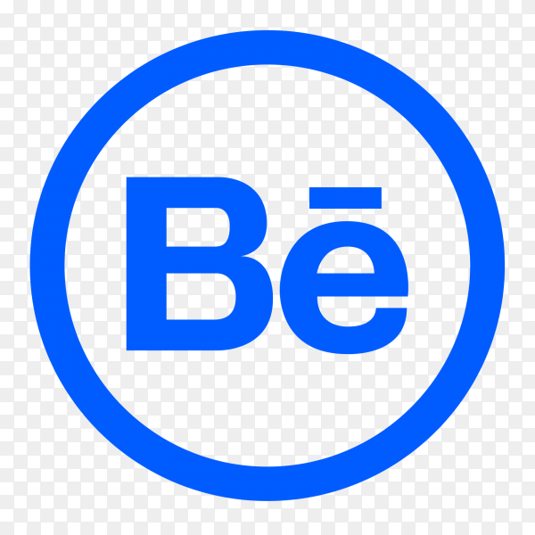

# Hello, I'm Mario! 👋

## I'm a Junior Software Developer with a background in Art & Design

- I have always been passionate about how tech pushes the audiovisual media to new territories.

- I am a career changer! Unafraid of oing from Art & Design into Software Development and looking forward to working with a friendly and like-minded team.

- I am very curious about everything and love learning. Taught myself how to draw, digital art, 3D design (huge fan of Blender), animation...

- I believe computers are the most sophisticated tool ever invented and the source of endless possibilities.

- I am creative and detail oriented. I invite you to take a look at my art portfolio.
## 🛠 Skills

## Stats

## 🔗 Links

<svg xmlns="http://www.w3.org/2000/svg" width="24" height="24" viewBox="0 0 24 24"><path d="M19 0h-14c-2.761 0-5 2.239-5 5v14c0 2.761 2.239 5 5 5h14c2.762 0 5-2.239 5-5v-14c0-2.761-2.238-5-5-5zm-11 19h-3v-11h3v11zm-1.5-12.268c-.966 0-1.75-.79-1.75-1.764s.784-1.764 1.75-1.764 1.75.79 1.75 1.764-.783 1.764-1.75 1.764zm13.5 12.268h-3v-5.604c0-3.368-4-3.113-4 0v5.604h-3v-11h3v1.765c1.396-2.586 7-2.777 7 2.476v6.759z"/ src="https://www.linkedin.com/in/mario-a-gonzalez-robert/"></svg>

